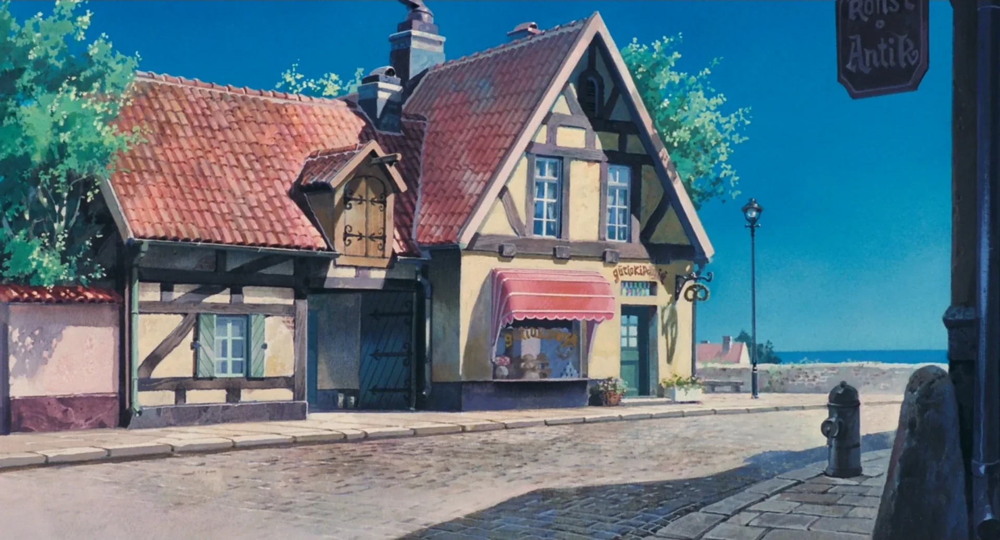

  

<table align="center">
  <tr>
    <td align="center">
      
    </td>
    <td align="center" width="300">
      
        
      <i>ghibli-inspired scenery, every time you open a new tab ˚｡⋆🌿</i>
        
      
      
    </td>
  </tr>
</table>

<picture>
  <source media="(prefers-color-scheme: dark)" srcset="https://raw.githubusercontent.com/emilyxietty/emilyxietty/output/github-snake-dark.svg" />
  <source media="(prefers-color-scheme: light)" srcset="https://raw.githubusercontent.com/emilyxietty/emilyxietty/output/github-snake.svg" />
  
</picture>
 
